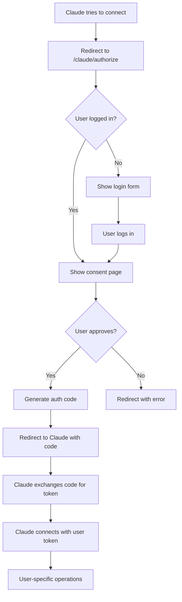

# Multi-User Authentication for Claude Integration

## Overview

We've implemented proper multi-user authentication for Claude integration! Now when Claude connects to your app, users are properly authenticated and each Claude session works with the specific user's data.

## How It Works

### 1. Authentication Flow



### 2. What Changed

#### Before (Problem):
- Claude always worked with the same demo user (ID: 1)
- No proper user authentication
- All Claude sessions shared the same wallet data

#### After (Solution):
- Claude redirects users to login/consent page
- Each user approves Claude access individually
- Claude gets user-specific access tokens
- Each Claude session works with the authenticated user's data

## Implementation Details

### 1. New Components

#### Frontend: ClaudeAuth Component (`frontend/src/components/ClaudeAuth.tsx`)
- Handles user login if not authenticated
- Shows consent page for Claude authorization
- Manages OAuth parameter handling
- Provides secure approval/denial flow

#### Backend: Multi-user Authentication
- Updated OAuth controller to show consent page instead of auto-approval
- Modified MCP SSE endpoint to require authentication
- Enhanced auth middleware to fetch real user data
- Added proper user ID handling throughout the system

### 2. Updated Endpoints

#### GET `/oauth/authorize`
```
Before: Auto-approved with demo user
After:  Redirects to consent page (/claude/authorize?params...)
```

#### POST `/oauth/authorize` (NEW)
```
Endpoint: POST /oauth/authorize
Auth:     Required (Bearer token)
Purpose:  Handle user consent approval/denial
```

#### `/mcp/sse`
```
Before: No authentication required
After:  Requires valid OAuth token with user ID
```

### 3. Database Integration

- OAuth tokens now properly linked to real user IDs
- All financial operations use authenticated user's data
- User-specific account isolation maintained

## Testing the Flow

### 1. Setup
```bash
# Start the backend
npm run docker:dev

# In another terminal, start frontend  
cd frontend
npm start
```

### 2. Test Multi-User Flow

#### Step 1: Create Multiple Users
```bash
# Register user 1
curl -X POST http://localhost:3000/api/auth/register \
  -H "Content-Type: application/json" \
  -d '{
    "name": "Alice Smith",
    "email": "alice@example.com", 
    "password": "SecurePass123!"
  }'

# Register user 2  
curl -X POST http://localhost:3000/api/auth/register \
  -H "Content-Type: application/json" \
  -d '{
    "name": "Bob Johnson",
    "email": "bob@example.com",
    "password": "AnotherPass456!"
  }'
```

#### Step 2: Test Claude Authorization

1. **Simulate Claude OAuth Request:**
```
GET https://your-ngrok-url/oauth/authorize?
  response_type=code&
  client_id=test-client&
  redirect_uri=https://claude.ai/callback&
  scope=mcp:tools:list mcp:tools:call wallet:accounts:read&
  state=random-state&
  code_challenge=test-challenge&
  code_challenge_method=S256
```

2. **Expected Flow:**
   - Redirects to: `https://your-ngrok-url/claude/authorize?[params]`
   - User sees login form (if not logged in) 
   - User sees consent page (if logged in)
   - User approves → gets authorization code
   - Claude exchanges code for access token

#### Step 3: Test MCP with User Token

```bash
# Get user token (login as Alice)
ALICE_TOKEN=$(curl -s -X POST http://localhost:3000/api/auth/login \
  -H "Content-Type: application/json" \
  -d '{"email": "alice@example.com", "password": "SecurePass123!"}' \
  | jq -r '.data.tokens.accessToken')

# Test MCP SSE connection with Alice's token
curl -H "Authorization: Bearer $ALICE_TOKEN" \
  https://your-ngrok-url/mcp/sse
```

### 3. Verify User Isolation

```bash
# Create account for Alice
curl -X POST http://localhost:3000/api/accounts \
  -H "Authorization: Bearer $ALICE_TOKEN" \
  -H "Content-Type: application/json" \
  -d '{
    "name": "Alice Main Account",
    "type": "checking",
    "balance": 1000.00
  }'

# Login as Bob and verify he doesn't see Alice's account
BOB_TOKEN=$(curl -s -X POST http://localhost:3000/api/auth/login \
  -H "Content-Type: application/json" \
  -d '{"email": "bob@example.com", "password": "AnotherPass456!"}' \
  | jq -r '.data.tokens.accessToken')

curl -H "Authorization: Bearer $BOB_TOKEN" \
  http://localhost:3000/api/accounts
# Should return empty array (Bob has no accounts)
```

## Claude.ai Integration

### 1. Adding to Claude.ai

When adding the integration to Claude.ai:

```
Server URL: https://your-ngrok-url/mcp/sse
```

### 2. User Experience

1. **First Time:** User clicks to add integration in Claude.ai
2. **Redirect:** Claude redirects to your app's consent page  
3. **Login:** User logs in (if not already authenticated)
4. **Consent:** User sees what Claude wants to access
5. **Approval:** User clicks "Authorize Claude"
6. **Success:** Claude gains access to user's financial data

### 3. Multiple Users

- Each user authorizes Claude separately
- Claude works with their individual wallet data
- No cross-user data access
- Secure token-based authentication

## Security Features

### 1. User Isolation
- Each OAuth token tied to specific user ID
- Database queries filtered by authenticated user
- No cross-user data leakage

### 2. Consent Management
- Users must explicitly approve Claude access
- Clear permission display (accounts, transactions, analytics)
- Deny option available

### 3. Token Security
- Short-lived access tokens (1 hour)
- User-specific token validation
- Proper OAuth 2.1 compliance

## Benefits

✅ **True Multi-User Support:** Each Claude session works with correct user data  
✅ **Secure Authentication:** Proper OAuth flow with user consent  
✅ **Data Isolation:** Users only see their own financial information  
✅ **Scalable:** Supports unlimited users with individual authentication  
✅ **Standards Compliant:** OAuth 2.1 with PKCE for security  

## Migration from Previous Setup

### What's Preserved
- Existing JWT authentication still works
- Backward compatibility maintained  
- All existing API endpoints function normally

### What's Enhanced
- MCP connections now require authentication
- OAuth tokens tied to real users
- Multi-user Claude integration support

## Troubleshooting

### Issue: "Authentication required" on MCP connection
**Solution:** Ensure Claude has valid OAuth token for specific user

### Issue: User sees wrong data in Claude
**Solution:** Check token validation and user ID extraction

### Issue: Consent page not showing
**Solution:** Verify OAuth redirect URL and frontend routing

### Issue: Cross-user data access
**Solution:** Review database queries for proper user filtering

---

**Next Steps:** Test with real Claude.ai integration and monitor user adoption! 