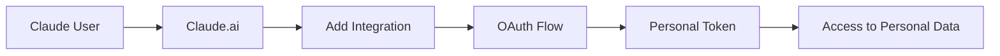

# 💰 Коммерческий Remote MCP для Claude.ai

## 🎯 Продукт: "Personal Finance Assistant for Claude"

### Целевая аудитория:
- **Claude Pro/Max/Team/Enterprise** пользователи
- Профессионалы, управляющие финансами
- Малый и средний бизнес
- Фрилансеры и консультанты

### Ценность:
- **Персональный финансовый помощник** прямо в Claude
- **Анализ расходов** с ИИ инсайтами
- **Управление бюджетом** и целями
- **Автоматизация** финансовых задач

## 🏗️ Архитектура решения

### 1. **Remote MCP Server** (https://your-finance-mcp.com)
```typescript
// Endpoints для Claude.ai
GET  /.well-known/mcp           // MCP Discovery
POST /mcp/tools                 // MCP Tools
POST /oauth/authorize           // OAuth Authorization
POST /oauth/token               // OAuth Token
```

### 2. **OAuth Flow для каждого пользователя**


### 3. **Персональные данные**
- Каждый пользователь = отдельная база данных
- Персональные токены с ограниченным доступом
- Подписки и лимиты по планам

## 📊 Монетизация

### Планы подписки:
- **Basic** ($9/месяц): 1,000 запросов, базовые инструменты
- **Professional** ($29/месяц): 10,000 запросов, продвинутая аналитика
- **Business** ($99/месяц): неограниченно, API доступ, команды

### Бесплатный пробный период:
- 7 дней полного доступа
- 100 запросов в месяц после trial

## 🔧 Техническая реализация

### 1. **Remote MCP Server**
```typescript
// mcp-server/src/remote-mcp-server.ts
class RemoteMcpServer {
  // OAuth авторизация
  async handleOAuthFlow(code: string): Promise<Token>
  
  // MCP Tools для Claude
  async listTools(userId: string): Promise<Tool[]>
  async callTool(userId: string, toolName: string, params: any): Promise<any>
  
  // Персональные данные
  async getUserData(userId: string): Promise<UserData>
}
```

### 2. **Пользовательская система**
```typescript
// User Management
interface McpUser {
  id: string;
  email: string;
  subscription: 'basic' | 'professional' | 'business';
  tokens: McpToken[];
  usage: UsageStats;
}

interface McpToken {
  token: string;
  scopes: string[];
  expiresAt: Date;
  usageCount: number;
}
```

### 3. **MCP Tools для финансов**
```typescript
const tools = [
  'addTransaction',      // Добавить транзакцию
  'getBalance',          // Получить баланс
  'analyzeSpending',     // Анализ расходов
  'createBudget',        // Создать бюджет
  'trackGoals',          // Отслеживать цели
  'generateReport',      // Генерировать отчёты
  'categorizeExpenses',  // Категоризировать расходы
  'planCashflow',        // Планировать денежный поток
];
```

## 🌐 Настройка в Claude.ai

### Для пользователей:
1. **Перейти в Settings > Integrations**
2. **Добавить**: `https://your-finance-mcp.com`
3. **OAuth авторизация** с вашим сервисом
4. **Активировать инструменты** в чате

### Пример использования:
```
User: "Проанализируй мои расходы за последний месяц"
Claude: *calls analyzeSpending tool*
Result: "За последний месяц вы потратили $2,340. 
Основные категории: рестораны 35%, транспорт 20%..."
```

## 📈 Маркетинг и развитие

### Каналы привлечения:
- **Claude.ai Integration Directory** (когда появится)
- **Personal Finance сообщества**
- **LinkedIn/Twitter маркетинг**
- **Product Hunt запуск**

### Партнёрства:
- **Банки** (API интеграции)
- **Accounting Software** (QuickBooks, Xero)
- **Investment Platforms** (Robinhood, E*TRADE)

## 🔒 Безопасность и соответствие

### Требования:
- **OAuth 2.1** авторизация
- **HTTPS** везде
- **Data encryption** at rest и in transit
- **GDPR/CCPA** соответствие
- **PCI DSS** для платежей

### Доверие пользователей:
- **Прозрачность** в использовании данных
- **Отзывы** и рейтинги
- **Security audit** от третьих лиц
- **Privacy policy** и **Terms of service**

## 🚀 Roadmap

### Phase 1 (MVP - 2-3 недели):
- ✅ Remote MCP Server с OAuth
- ✅ Базовые финансовые инструменты
- ✅ Пользовательская система
- ✅ Простая подписка

### Phase 2 (Growth - 1-2 месяца):
- 📊 Продвинутая аналитика
- 🏦 Интеграции с банками
- 📱 Mobile app
- 🎯 Продвинутые цели и бюджеты

### Phase 3 (Scale - 3-6 месяцев):
- 🏢 Team/Enterprise функции
- 🤖 AI-powered insights
- 📊 Business intelligence
- 🌍 Multi-currency support

## 💡 Конкурентные преимущества

1. **Первый в Claude ecosystem** - early mover advantage
2. **AI-native** - использует полную мощь Claude
3. **Простота использования** - прямо в Claude чате
4. **Персонализация** - ИИ знает контекст пользователя
5. **Безопасность** - OAuth + encrypted data

## 📊 Прогнозы

### Консервативный сценарий:
- **100 пользователей** в первый месяц
- **500 пользователей** через 6 месяцев  
- **$15,000 MRR** через год

### Оптимистичный сценарий:
- **500 пользователей** в первый месяц
- **5,000 пользователей** через 6 месяцев
- **$150,000 MRR** через год

---

**Вывод**: Remote MCP для Claude.ai - это отличная возможность создать коммерческий продукт с минимальными барьерами для пользователей и высокой ценностью! 🚀 